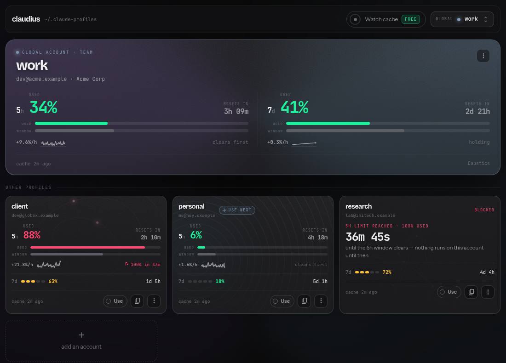
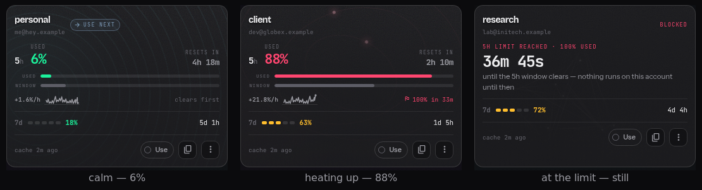
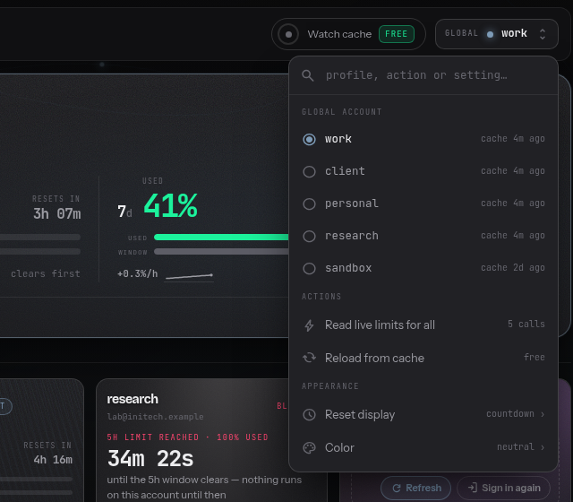
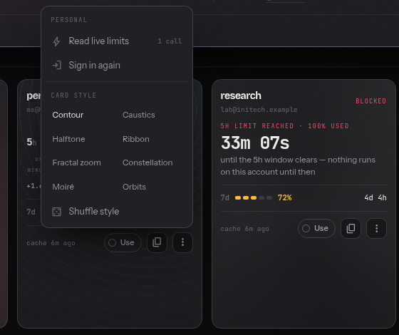
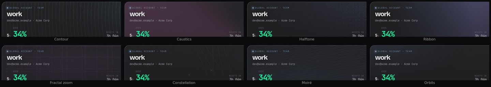
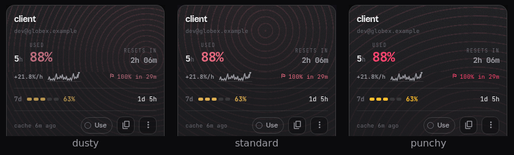
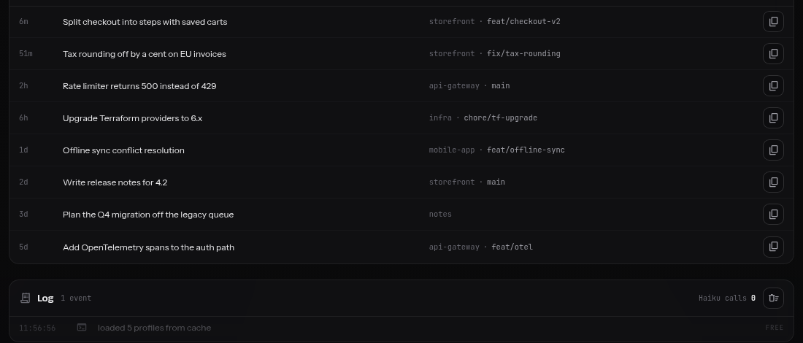

<div align="center">

# claudius

**All your Claude accounts in one place.**<br>
See every account's limits at a glance, switch in one click, and run several at once.




</div>

## Why

Several Claude accounts mean several sets of limits, and Claude Code shows only
the one you are signed in to. claudius shows all of them, tells you which one to
use next, and lets you use any of them without logging out of the others.

## Highlights

- **Every limit at a glance.** 5-hour and 7-day usage for every account, with
  reset countdowns.
- **Know before you hit the wall.** A burn rate per account, and the time you
  will reach 100% if that comes before the reset.
- **`claudius next` picks for you.** The account with the most room left, in one
  word, ready for scripts.
- **Several accounts at once.** `claudius run work` opens a session on `work`
  without touching the account your other terminals use.
- **One history across accounts.** Start a session on one account, resume it on
  another. Agents, commands, skills and `CLAUDE.md` are shared too.
- **Agents on every account, on one board.** Start, read, open and stop
  background agents, each through the account it runs on.
- **Usage tracking costs nothing.** The optional status line records your limits
  as you work, with no extra API calls.
- **Sign in from the browser.** Add an account, or sign one in again, from the
  dashboard.

## The dashboard

```bash
claudius serve --open
```

A local page at `127.0.0.1`. The account you are on gets the large panel; the
others sit below it as cards. The card marked **use next** is the one
`claudius next` would pick.

The browser tab shows your current account's usage, so you can keep an eye on
it from any other tab:

```text
🟢 34% · 41% — work                    5h · 7d usage, colored by the worse one
⛔ 5h full · clears in 28m — research   at the limit: when it opens again
```

### It moves with your usage

Every card has an animated background, and its motion is a reading, not
decoration. It is calm when there is plenty of room, speeds up and heats up as a
limit gets close, and stops completely when the limit is reached.



### Make it yours

Open the account menu at the top right to switch accounts, read all limits, or
change how the page looks. Every card's own **⋮** menu picks its background.

<table>
<tr>
<td width="50%"></td>
<td width="50%"></td>
</tr>
<tr>
<td><b>Appearance</b> — reset times as a countdown, a clock time or the
window's total; a neutral, cool or warm tint; and how strong the warning
colors are.</td>
<td><b>Card style</b> — eight animated backgrounds per card, or <b>Shuffle</b>.
The page's own background follows the active account's card.</td>
</tr>
</table>





Your choices are remembered in the browser.

### Pick up any session

Recent sessions from all accounts, searchable by title, path or branch. Copy the
command to resume one on whichever account you like.



## In the terminal

`claudius` on its own opens an interactive picker. Everything else is one
command:

```text
$ claudius next --explain
                    5h    7d      burn  why
→ personal          6%   18%    +1.6/h  82% left on the 7d
  work             34%   41%    +9.6/h  59% left on the 7d
  client           88%   63%   +21.8/h  12% left on the 5h · hits it ~12:27
  research        100%   72%   +24.6/h  at the 5h limit · clears 12:31

$ claudius history client
client
    5h   87%  ▁▁▁▁▆▃▄▅▃▄▂▃▆▃▂▃▄▄▅▃▄▅▆▇  +21.8%/h    → 100% around 12:27
    7d   63%  ▂▂▂▂▃▃▃▃▃▄▄▄▄▅▅▅▅▅▅▅▅▅▅▅  +0.6%/h     → the window clears first
```

```bash
claudius run "$(claudius next)"   # open a session on the account with most room
claudius activate work             # make 'work' the account plain `claude` uses
claudius agents                    # background agents across every account
```

## Platform support

| | Status | Notes |
| --- | --- | --- |
| **Linux** | ✅ Supported | Developed and tested here |
| **WSL2** | ✅ Supported | Same as Linux |
| **macOS** | ✅ Supported | Works with the login Keychain. Running several accounts at once needs Claude Code 2.1.220 or newer |
| **Windows** | ➖ Use WSL2 | claudius is a bash script |

Needs **bash 3.2+**, **Ruby 2.5+** and the **`claude`** CLI. The dashboard also
needs the `webrick` gem (`gem install webrick`). Nothing else: no Python, no
Node packages, no `jq`.

## Install

```bash
git clone https://github.com/theExtraTerrestrial/claudius.git ~/.claudius && bash ~/.claudius/install.sh
```

Open a new shell, then:

```bash
claudius add work        # sign in an account (opens the browser)
claudius add personal    # …and another
claudius serve --open    # open the dashboard
claudius statusline      # optional: free usage tracking in Claude Code
```

Update with `git -C ~/.claudius pull`. Uninstall with
`bash ~/.claudius/install.sh --uninstall`.

## Safe by design

- The dashboard listens on `127.0.0.1` only, never your network.
- Tokens never appear in the page, the API, logs or errors.
- Every action on the page goes through the same CLI you use in the terminal.
- Removing an account never signs you out of Claude Code.

## Learn more

- **[The full guide](docs/guide.md)**: every command, how `next` ranks accounts,
  sharing sessions, macOS details, agents and the status line.
- **[Internals](docs/internals.md)**: why it is built the way it is.

MIT licensed.
